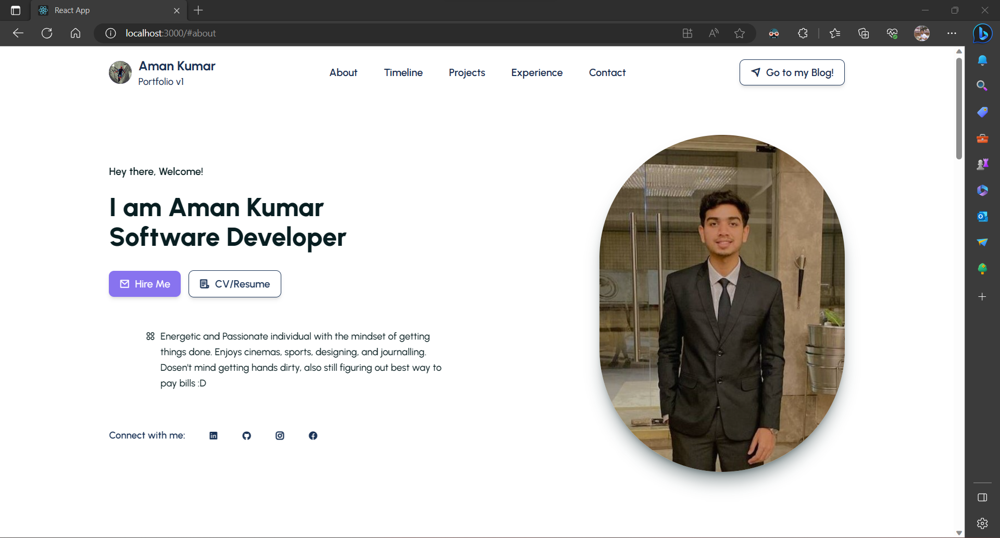

# Personal Portfolio Website @v1 - Aman Kumar

___

The website is created using **React** and designing is done with the help of **Tailwind CSS**. This was my first attempt with this combo, anyhow had to take quite a lot of references from different developers and designers, but understood it all along the way.

You may clone this repository to your local machine using the simple instructions already made available by GitHub.

---

After finishing the project I deployed it using Vercel.
You may have a look at the live website here: https://ak14aman.vercel.app/

---

*The provided code is authentic and intended for learning and educational purposes. You are free to use it as a reference or maybe taking code snippets for replicating the design in your project. Have a good time experimenting Tailwind CSS :D*